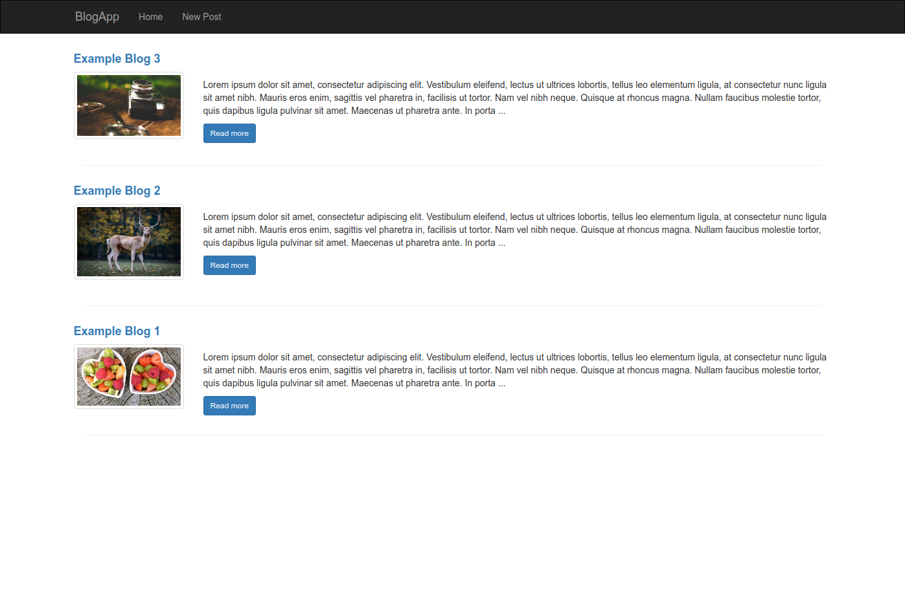
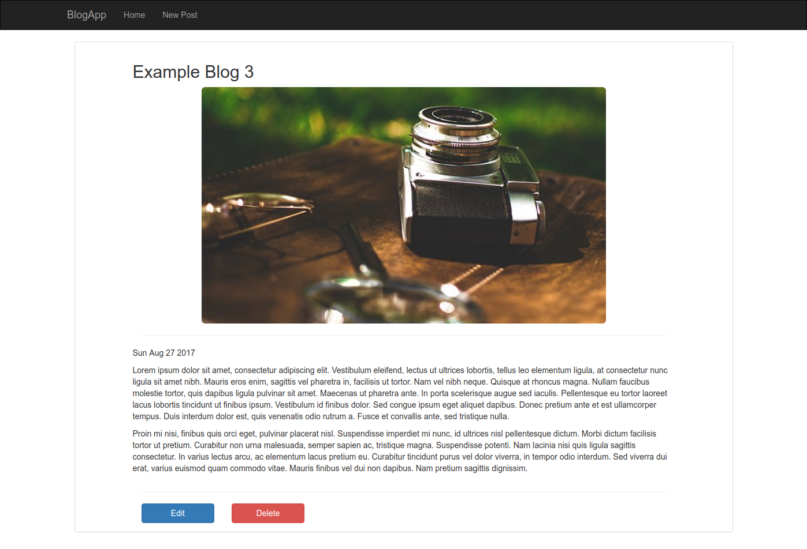

# BlogApp
Simple blog application.

## About
A simple blog application following RESTful routing. Created using node.js, express, and mongodb.

## Screenshots
 

## How to use
Install dependencies by executing:
~~~
$ npm install
~~~
Make sure you have mongodb up and running.  
Run by executing:
~~~
$ node app.js
~~~
